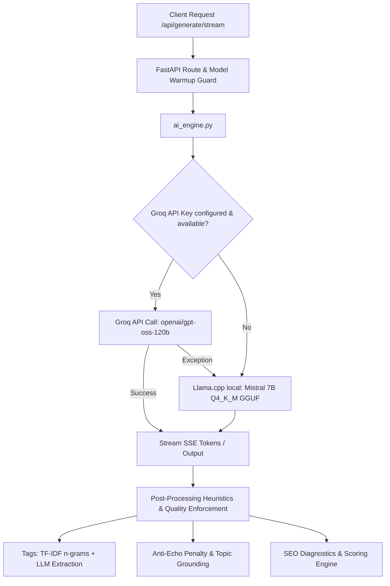
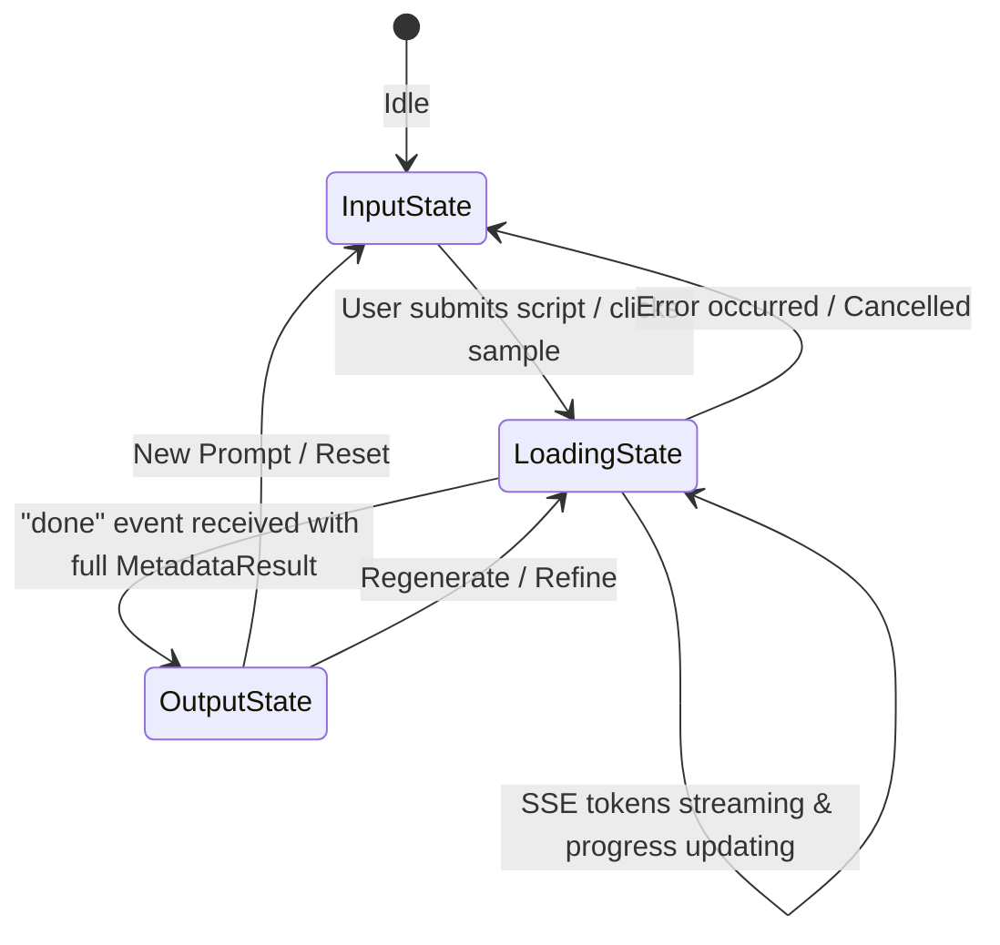

# MetaGen System Context & Architectural Reference

> **Permanent Project Context Repository**  
> *This file serves as the single source of truth for the MetaGen architecture, codebase organization, data flows, AI inference pipeline, and operational procedures.*

---

## 1. Executive Summary & Purpose

**MetaGen** is a full-stack, AI-powered YouTube SEO & Metadata Generation platform. It transforms raw video scripts, outlines, or transcripts into high-performing, algorithmically optimized YouTube metadata packages:
- **SEO-Optimized Titles** (40–80 chars, curiosity-driven hooks, entity grounding)
- **Comprehensive Video Descriptions** (150–250 words, structured hooks, key takeaways, and calls-to-action)
- **Targeted SEO Tags** (5–12 precise multi-word tags combining broad & niche entities)
- **Quantitative SEO Diagnostics** (Score breakdown: title, description, tags, keyword relevance, readability)
- **A/B Test Title Variants** (Alternative high-conversion title variations)

The application utilizes a **Dual-Path Hybrid Inference Architecture** with an **Interactive Model Selector**:
1. **Primary Cloud Inference (Groq LPU):** Generates streaming metadata packages using `openai/gpt-oss-120b` (OpenAI 120B open-weight model at ~500 T/s) via Groq in under 1.5 seconds.
2. **Fallback / Custom Local Inference (Llama.cpp CPU):** Runs a custom fine-tuned Mistral 7B Q4_K_M GGUF model (`custom-mistral-yt-seo-Q4_K_M.gguf`) hosted directly on Hugging Face Spaces (CPU runtime).
3. **Interactive Model Selector & Live Indicator:** Creators can choose between `Auto (Hybrid)`, `Groq 120B (Cloud LPU)`, and `Mistral 7B (Custom HF)` directly from the header and input bar. The UI indicates the active model in real-time, displays it in generation telemetry, and logs it per history item.

---

## 2. Repository & File Structure

```text
MetaGen-Production/
├── .dockerignore
├── .gitignore
├── DEPLOYMENT_PROGRESS.md      # Deployment tracking for Hugging Face & Vercel
├── Dockerfile                  # Production container for Hugging Face Spaces (Python 3.11-slim)
├── README.md                   # Public overview & setup guide
├── download_model.py           # Lazy runtime model downloader from Hugging Face Hub
├── requirements_hf.txt         # Backend Python dependencies (CPU-optimized build)
├── run_app.py                  # Entrypoint wrapper for Docker/HF Spaces (ensures model + runs Uvicorn)
├── start.sh                    # Shell runner script (legacy fallback)
├── CONTEXT.md                  # System architecture and codebase context (this file)
│
├── backend/                    # FastAPI Backend Application
│   ├── __init__.py
│   ├── main.py                 # FastAPI app, API routes, middleware, lifespan handlers
│   ├── config.py               # Pydantic Settings singleton (loads from .env and environment)
│   ├── ai_engine.py            # AI inference engine, dual-path dispatcher, prompts & heuristics
│   ├── keyword_extractor.py    # Zero-dependency term-frequency & n-gram tag extraction engine
│   ├── celery_worker.py        # Background task worker (Celery + Redis) for async poll mode
│   ├── logger.py               # Centralized logging configuration
│   ├── model/                  # Local directory for downloaded .gguf models
│   ├── services/
│   │   ├── __init__.py
│   │   └── model_runtime.py    # Warmup gates, keep-warm heartbeat daemon, concurrency locks
│   └── utils/
│       ├── __init__.py
│       ├── prompt_factory.py   # Strict prompt templates for JSON metadata and variants
│       └── text_processing.py  # Sentence splitting and regex text manipulation helpers
│
└── frontend/                   # Next.js 16 (App Router) Frontend Application
    ├── .env.local              # Local development environment overrides
    ├── .env.production         # Production environment configs (API URLs)
    ├── components.json         # Shadcn/UI configuration
    ├── next.config.mjs         # Next.js configuration
    ├── package.json            # Node.js dependencies (React 19, Framer Motion 12, Tailwind 4)
    ├── postcss.config.mjs      # PostCSS configuration for Tailwind 4
    ├── tsconfig.json           # TypeScript configuration
    ├── app/
    │   ├── globals.css         # OKLCH-based theme variables, glassmorphism utilities, grid styles
    │   ├── layout.tsx          # Root HTML layout with ThemeProvider and fonts
    │   └── page.tsx            # Main state machine orchestrator (input -> loading -> output)
    ├── components/
    │   ├── metagen/
    │   │   ├── header.tsx              # Glassmorphism navigation bar with theme and history toggle
    │   │   ├── history-sidebar.tsx     # Session-based historical generation viewer
    │   │   └── morphing-container.tsx  # Central morphing glass container, inputs, results, SEO metrics
    │   ├── saas/                       # Layout components for multi-view SaaS styling
    │   │   ├── layout.tsx
    │   │   ├── sidebar.tsx
    │   │   └── topbar.tsx
    │   ├── theme-provider.tsx          # Next-themes provider wrapper
    │   └── ui/                         # 50+ Accessible Radix-UI/Shadcn primitives
    ├── hooks/
    │   ├── useGenerate.ts              # Async polling generation hook (Celery backend)
    │   ├── useStreamGenerate.ts        # Primary SSE real-time streaming hook
    │   ├── useStreamParser.ts          # Low-level chunked stream parser
    │   ├── useTitleVariants.ts         # A/B title variant generation hook
    │   ├── useWarmupAndDepsHealth.ts   # Background health check hook for model & workers
    │   └── use-mobile.ts / use-toast.ts
    └── lib/
        ├── api.ts              # REST client for backend endpoints
        ├── constants.ts        # System constants, URL resolution & fallback logic
        ├── sse.ts              # SSE event parsing & formatting utilities
        ├── types.ts            # TypeScript interfaces matching backend Pydantic models
        └── utils.ts            # UI class merging helper (clsx + tailwind-merge)
```

---

## 3. Dual-Path AI Inference Architecture



### 3.1 Inference Strategies (`GENERATION_STRATEGY`)
The engine supports 5 selectable strategies (set via `GENERATION_STRATEGY` environment variable):
1. `tfidf_streaming` (**Default & Production Recommended**): Uses lightweight TF-IDF keyword extraction for instant tags, followed by streamed LLM generation for title & description.
2. `streaming`: Single streamed LLM call producing the entire JSON payload via Server-Sent Events.
3. `tfidf_tags`: High-speed non-streaming strategy pairing fast CPU TF tags with non-streamed LLM title/description.
4. `two_pass`: Two sequential LLM calls (first title + tags, then description conditioned on title/tags).
5. `standard`: Single non-streaming LLM call producing title, description, and tags in one shot.

### 3.2 Key Heuristics & Quality Guardrails
- **Anti-Echo Penalty:** Prevents the LLM from regurgitating the input script verbatim in the description; replaces duplicate sentences with grounded summaries and calls-to-action.
- **Script Grounding:** Extracts key nouns, bigrams, and entities from the script to ensure generated metadata is strictly relevant and not generic clickbait.
- **Dynamic Token Budgeting:** Dynamically calculates input character budgets and output token reservations (`stream_title_desc_max_tokens`, `non_stream_title_desc_max_tokens`) to avoid truncated JSON responses.
- **Safe JSON Extraction:** Features a multi-tiered fallback parser (`_parse_json_safe` and `_extract_json_fields_fallback`) using regex patterns if the LLM adds markdown backticks or incomplete closing braces.

---

## 4. Backend Architecture & API Specification

The backend is built with **FastAPI** running on Python 3.11 with asynchronous lifecycle management and rate limiting.

### 4.1 API Endpoints

| Endpoint | Method | Auth | Description |
| :--- | :--- | :--- | :--- |
| `/` | `GET` | None | API Root status, docs pointer, version. |
| `/health` | `GET` | None | Basic liveness probe (`{"status": "healthy"}`). |
| `/health/warmup` | `GET` | None | Model warmup status (`ready`, `warming`, `error`, duration). |
| `/health/deps` | `GET` | None | Dependency probe for Redis & Celery worker readiness. |
| `/api/diagnostics/inference` | `GET` | Header `X-API-Key` (Optional) | Detailed diagnostic metrics, GPU memory usage, last run timings. |
| `/api/generate/stream` | `POST` | Header `X-API-Key` (Optional) | **Primary generation route**. Streams metadata tokens via SSE (`text/event-stream`). |
| `/api/generate` | `POST` | Header `X-API-Key` (Optional) | Enqueues background generation task in Celery/Redis; returns `task_id`. |
| `/api/status/{task_id}` | `GET` | Header `X-API-Key` (Optional) | Polls task completion status (`Processing`, `Completed`, `Failed`). |
| `/api/title-variants` | `POST` | Header `X-API-Key` (Optional) | Generates alternative high-converting titles for A/B testing. |

### 4.2 SSE Streaming Protocol (`/api/generate/stream`)
The stream yields JSON strings in Server-Sent Event format (`data: <json>\n\n`):
1. **`tags` Event:** `{"type": "tags", "data": ["tag1", "tag2", ...]}` (Emitted early in `tfidf_streaming` mode)
2. **`token` Event:** `{"type": "token", "data": "word "}` (Emitted as LLM produces tokens)
3. **`done` Event:** `{"type": "done", "data": { "title": "...", "description": "...", "tags": [...], "seo_score": 92.5, "seo_breakdown": {...} }}`
4. **`error` Event:** `{"type": "error", "message": "Reason for failure"}`

### 4.3 Model Warmup & Keep-Warm Heartbeat
Implemented in `backend/services/model_runtime.py`:
- `prewarm_model_runtime`: Initializes LLM weights in memory upon server start.
- `ensure_model_warm_ready`: Route gate ensuring requests wait or return 503 if the model is still loading.
- `run_keep_warm_heartbeat`: Async background daemon running periodic token pings every 240s to prevent CPU cache/memory eviction in serverless or shared container environments.

---

## 5. Frontend Architecture & UI/UX Design System

The frontend is built on **Next.js 16.2** (Turbopack) and **React 19**, styled with **Tailwind CSS 4** and animated using **Framer Motion 12**.

### 5.1 Main State Machine (`app/page.tsx`)


### 5.2 Key UI Components
- **`MorphingContainer` (`components/metagen/morphing-container.tsx`):**
  - Expands fluidly from a compact prompt bar into an expanded editor with sample script chips and file upload support (`.txt`, `.md`, `.rtf`).
  - Morphs into a split-screen dashboard displaying source script alongside live-streamed or finalized output.
  - Interactive copy buttons for individual fields or complete metadata bundle.
  - Interactive SVG circular score gauge and breakdown bars for Title, Description, Tags, Keyword Relevance, and Readability.
- **`Header` (`components/metagen/header.tsx`):**
  - Glassmorphic top navigation with dynamic OKLCH dark/light theme switching.
  - Real-time "Neural Active" indicator.
  - History drawer trigger.
- **`HistorySidebar` (`components/metagen/history-sidebar.tsx`):**
  - Session-persisted cache storing up to 20 past generations.
  - Allows instant one-click restoration of prior metadata generations.

---

## 6. Data Models & Type Contracts

### 6.1 Backend Pydantic Models (`backend/main.py`)
```python
class VideoRequest(BaseModel):
    text: str = Field(..., min_length=20, max_length=3000)

class TitleVariantsRequest(BaseModel):
    text: str = Field(..., min_length=20, max_length=3000)
    base_title: str = Field(..., min_length=5, max_length=120)
    count: int = Field(default=2, ge=1, le=5)

class SeoBreakdown(BaseModel):
    title: float = Field(..., ge=0, le=100)
    description: float = Field(..., ge=0, le=100)
    tags: float = Field(..., ge=0, le=100)
    keyword_relevance: float = Field(..., ge=0, le=100)
    readability: float = Field(..., ge=0, le=100)

class MetadataResult(BaseModel):
    title: str = Field(..., min_length=40, max_length=60)
    description: str = Field(..., min_length=800, max_length=1300)
    tags: list[str] = Field(..., min_length=5, max_length=8)
    seo_score: float | None = Field(default=None, ge=0, le=100)
    seo_breakdown: SeoBreakdown | None = None
```

### 6.2 Frontend TypeScript Interfaces (`frontend/lib/types.ts`)
```typescript
export interface SeoBreakdown {
  title: number;
  description: number;
  tags: number;
  keyword_relevance: number;
  readability: number;
}

export interface MetadataResult {
  title: string;
  description: string;
  tags: string[];
  seo_score?: number;
  seo_breakdown?: SeoBreakdown;
}

export interface GenerationResult extends MetadataResult {
  latency: number;
  model: string;
  timestamp: Date;
  inputScript: string;
}

export interface HistoryItem extends GenerationResult {
  id: string;
}
```

---

## 7. Deployment & Environment Configuration

### 7.1 Environment Variables Reference

| Variable | Scope | Description | Default |
| :--- | :--- | :--- | :--- |
| `GROQ_API_KEY` | Backend | API Key for Groq Cloud inference | `""` (Falls back to local GGUF) |
| `GROQ_MODEL` | Backend | Model ID for Groq Cloud inference | `openai/gpt-oss-120b` |
| `MODEL_PATH` | Backend | File path for local GGUF model | `backend/model/custom-mistral-yt-seo-Q4_K_M.gguf` |
| `GENERATION_STRATEGY` | Backend | Strategy selector | `tfidf_streaming` |
| `REDIS_URL` | Backend | Redis broker/backend URL for Celery async polling | `redis://localhost:6379/0` |
| `API_KEY` | Backend | Optional bearer secret for `X-API-Key` authentication | `""` (Open access) |
| `RATE_LIMIT` | Backend | SlowAPI rate limit rule | `10/minute` |
| `CORS_ORIGINS` | Backend | Comma-separated allowed origins | `*` (configured in `main.py`) |
| `NEXT_PUBLIC_API_URL` | Frontend | Target backend API base URL | `https://sujalchhajed925-metagen.hf.space` |

### 7.2 Production Infrastructure
- **Backend (Hugging Face Spaces):**
  - Base: Docker container (`python:3.11-slim`)
  - Target URL: `https://sujalchhajed925-metagen.hf.space`
  - Runs `run_app.py` on Port `7860`.
  - Downloads model lazily on first boot via `download_model.py` to bypass Git LFS repository storage quotas.
- **Frontend (Vercel):**
  - Production URL: `https://metagen-one.vercel.app`
  - Automated CI/CD from repository root `frontend/`.

---

## 8. Local Development Commands

### Running Backend Locally
```bash
# From workspace root
python -m venv venv
# On Windows:
.\venv\Scripts\activate
# On Unix/macOS:
source venv/bin/activate

pip install -r requirements_hf.txt
# Set optional Groq API key:
$env:GROQ_API_KEY="your-groq-key" # PowerShell
# export GROQ_API_KEY="your-groq-key" # Bash

python -m uvicorn backend.main:app --host 0.0.0.0 --port 8000 --reload
```

### Running Frontend Locally
```bash
cd frontend
npm install
npm run dev
# App will run at http://localhost:3000
```

---
*Maintained and documented for continuous agentic development and automated pair-programming workflows.*
