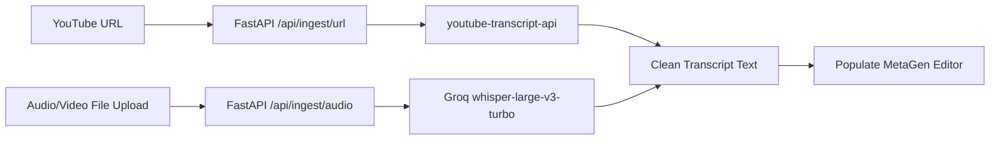

# Feature Spec F-04: YouTube URL & Whisper Audio Ingestion

## 1. Overview & Business Value
Creators frequently want to:
1. Re-optimize an existing live YouTube video that is underperforming in search/browse.
2. Ingest raw recorded audio/video (`.mp3`, `.mp4`, `.wav`, `.m4a`) directly without having to manually transcribe it first.

---

## 2. Zero-Dependency Contract
Completely modular input ingestion stage. It accepts external media (URL or audio file) and outputs clean text into MetaGen's core script editor.

---

## 3. Architecture & Data Flow



---

## 4. API Specification

### Endpoint 1: YouTube URL Ingestion
- **Route:** `POST /api/ingest/url`
- **Request Body:**
  ```python
  class UrlIngestRequest(BaseModel):
      url: str = Field(..., description="Valid YouTube watch URL or youtu.be shortlink")
  ```
- **Response:**
  ```python
  class IngestResponse(BaseModel):
      title: str | None = None
      transcript: str
      word_count: int
      duration_seconds: int | None = None
  ```
- **Implementation:**
  - Parse video ID from URL regex: `(?:v=|\/)([0-9A-Za-z_-]{11})`.
  - Use `youtube-transcript-api` to fetch auto-generated or manual captions.
  - Concatenate caption lines into continuous paragraph text.

### Endpoint 2: Audio/Video Transcription via Groq Whisper
- **Route:** `POST /api/ingest/audio`
- **Request:** `multipart/form-data` (file: `UploadFile`, max size 25MB).
- **Processing:**
  - Send audio stream to Groq's `whisper-large-v3-turbo` model via `groq.audio.transcriptions.create(file=..., model="whisper-large-v3-turbo")`.
  - Transcribes a 15-minute audio file in under 3 seconds.
- **Response:** Returns `{"transcript": "...", "word_count": 1420}`.

---

## 5. Frontend UI/UX Specification
- **Component Location:** Tabs at the top of `TerminalCore` in Input stage:
  - `[ 📝 Paste Script ]` (Default)
  - `[ 🔗 YouTube URL ]` (Input field + "Fetch Transcript" button)
  - `[ 🎙️ Upload Audio / Video ]` (Drag-and-drop zone with format chips `.mp3, .wav, .m4a, .mp4`)
- When ingestion succeeds, the transcript smoothly populates the editor with word count and speaking time metrics.

---

## 6. Verification & Test Plan
- **Unit Test (URL):** Test with standard YouTube URLs (`https://www.youtube.com/watch?v=...` and `https://youtu.be/...`) ensuring clean transcript extraction.
- **Unit Test (Audio):** Send a 10-second test `.mp3` audio clip to `/api/ingest/audio` and verify accurate Whisper transcription text.
