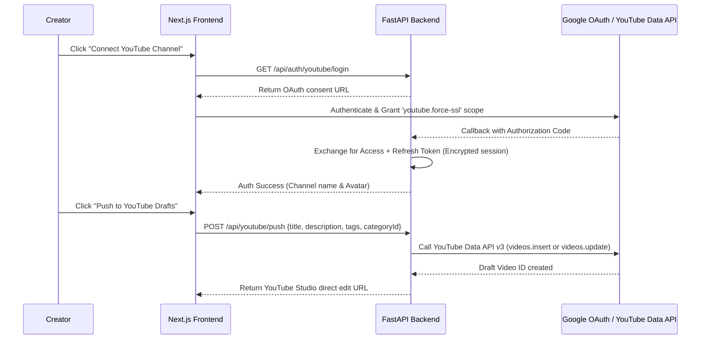

# Feature Spec F-06: 1-Click YouTube Studio Export (OAuth)

## 1. Overview & Business Value
Copy-pasting titles, descriptions, tags, and timestamps manually into YouTube Studio takes time and introduces formatting mistakes.
- **Value Proposition:** Connect a YouTube channel via Google OAuth 2.0 and push generated metadata directly into YouTube Studio as a draft or update an existing video with 1 click.

---

## 2. Zero-Dependency Contract
Completely standalone post-generation action. Functions through a secure, optional OAuth integration.

---

## 3. Architecture & Security Flow



---

## 4. API Endpoints Specification

### 1. `GET /api/auth/youtube/login`
- Initiates Google OAuth2 authorization code flow requesting scope:
  `https://www.googleapis.com/auth/youtube.force-ssl`

### 2. `GET /api/auth/youtube/callback`
- Exchanges authorization code for credentials and saves secure httpOnly session cookie.

### 3. `POST /api/youtube/export`
- **Request Body:**
  ```python
  class YouTubeExportRequest(BaseModel):
      title: str
      description: str
      tags: list[str]
      privacy_status: str = Field(default="private", description="'private', 'unlisted', or 'public'")
      existing_video_id: str | None = None
  ```
- **Response:**
  ```python
  class YouTubeExportResponse(BaseModel):
      success: bool
      video_id: str
      studio_url: str  # e.g. https://studio.youtube.com/video/{video_id}/edit
  ```

---

## 5. Frontend UI/UX Specification
- **Component Location:** Added to the Top Actions Bar in `OutputGrid`:
  - `[ 🚀 Push to YouTube Studio ]`
- When connected, shows the creator's YouTube channel avatar and title.
- On click, executes the push and displays a direct link: `"Open in YouTube Studio ↗"`.

---

## 6. Verification & Test Plan
- **Security Check:** Verify tokens are stored securely and never exposed client-side.
- **Integration Test:** Perform OAuth flow on a test Google account and verify metadata populates correctly in YouTube Studio.
